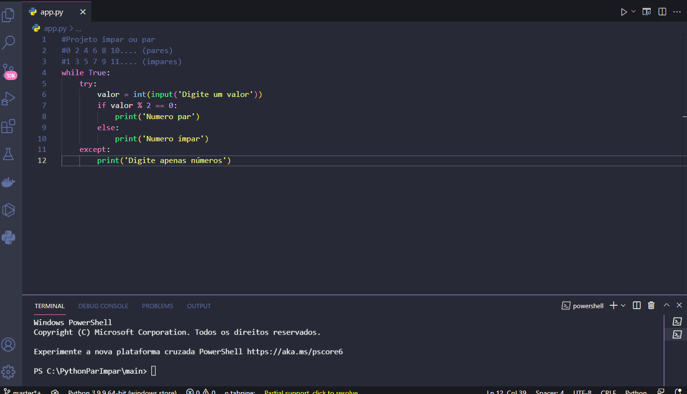

<h1 align="center">
  
   
  Python Even and Odd
</h1>

<h3 align="justify">
Practical demonstration of extracting and identifying even and odd numbers at the time of typing by the user.
</h3>

 

## 📷 Demonstration

<h4 align="left"></h4>
  

 

## 🚀 Technologies

This project was developed with the following technologies:

- Python

## ⚙ Sources and Documentation
- https://docs.python.org/pt-br/3/tutorial/

 

Made with 💜 by Rafael Maciel
